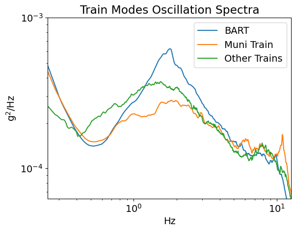
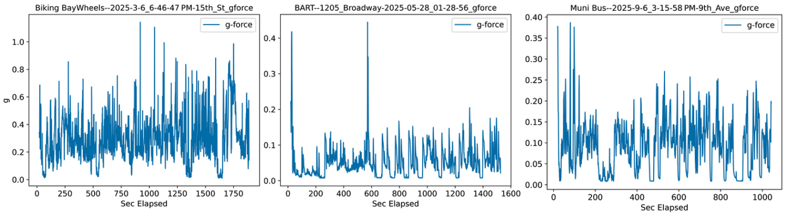
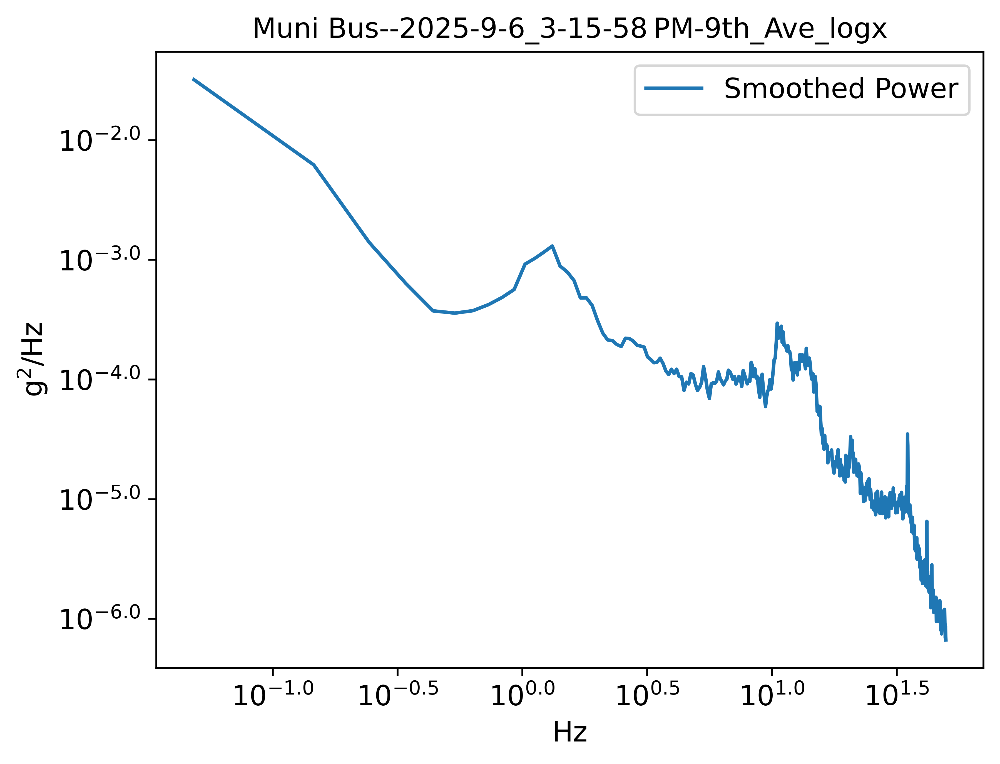
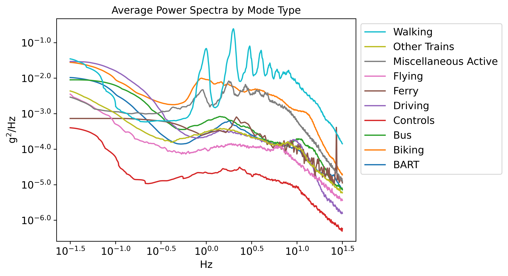
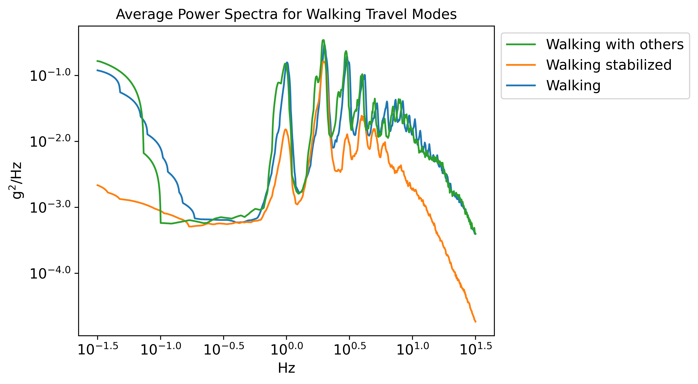
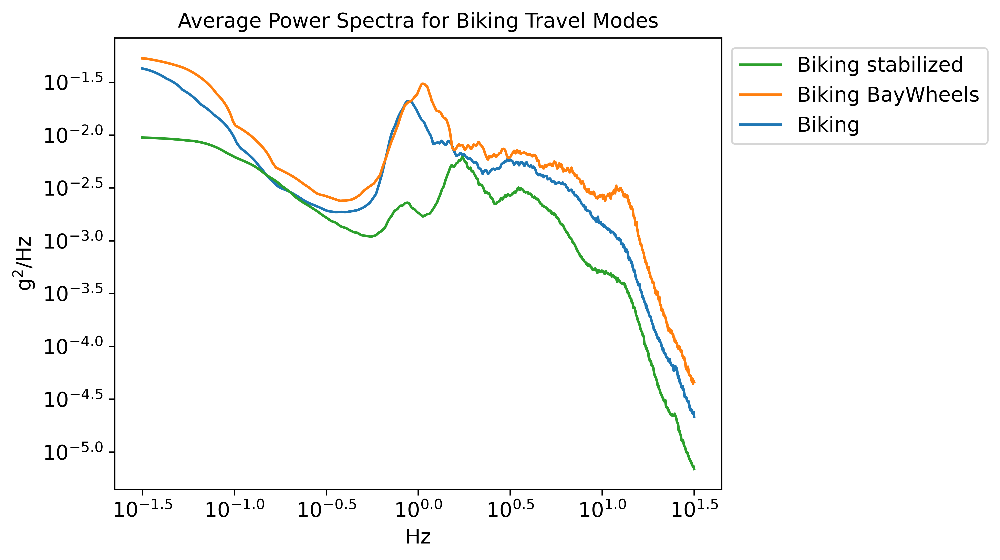
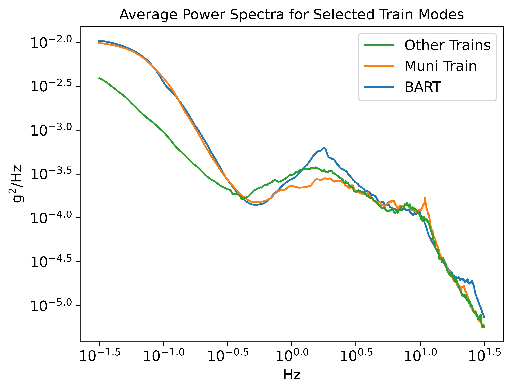

# A Personal Study of Oscillation on BART and Other Daily Activities

[Zack Subin](https://github.com/zmsubin)

**DRAFT**: _Last Updated Jan 3, 2026_

## Background and Findings

I am an urbanist living in San Francisco. My husband and I share one car, and I use active and public transportation for nearly all my daily activities. Since 2012, I've had chronic migraine, which makes me especially susceptible to motion sickness (a consequence of a crash at a poorly designed Berkeley intersection\- but that's a subject for another article!).

I have experienced consistent discomfort while riding BART since the pandemic, during which BART completed its train fleet replacement. Since 2023, I have been commuting to downtown Oakland from Balboa Park Station. I perceive the new train cars have a rougher ride, characterized by sideways oscillation (perpendicular to the direction of travel) which is especially bad on higher-speed segments such as the Transbay Tube. Some rides are definitely worse than others, but it is a widespread problem I notice on most. I do not remember this level of discomfort in prior BART rides during my 20 years living in the Bay Area, including daily commutes from Balboa Park to Montgomery Stations from 2018 through spring 2020. I have reported my experience to BART via multiple contact methods but no confirmation of this phenomenon was provided.

In May 2025, I became curious to see if I could measure the bothersome behavior myself using [Sensor Logger](https://www.tszheichoi.com/sensorlogger), a freemium app developed by physicist and transportation engineer Kelvin Choi. Since May I have recorded and analyzed over 400 activity segments, including over 160 BART rides.

**I preliminarily conclude that BART has a ubiquitous oscillation with a peak near 1.8 Hz, which I do not observe on other modes of transit. I hypothesize this is due to [Hunting Oscillation](https://en.wikipedia.org/wiki/Hunting_oscillation) in the new train cars**, perhaps because these reverted to conventional conical wheels unlike BART's [original cylindrical wheels](https://www.bart.gov/news/articles/2018/news20180606), unmasking other  Hunting contributors.

I expand below. Readers may also refer to the accompanying Technical Note briefly documenting the analysis code.

I continue to collect data, and especially need more samples of electrified heavy-rail systems like Caltrain. Please [contact me](mailto:transitoscillation@realemail.net) if you would like to contribute.

## Introduction: why analyze acceleration power spectra?

No direct perception of motion occurs when moving at a constant speed: acceleration is what creates the feeling of motion (in the absence of other sensor input such as vision, sound, and vibrations). But a typical trip starts and ends at zero velocity, so average acceleration is zero. We could instead examine the absolute magnitude of acceleration, commonly expressed as a ratio of gravity ("g-force"). This is directly measured by Sensor Logger.

Three example trips showing g-force smoothed to about 1 second intervals:

A previous Sensor Logger-based [project](https://sensorlogger.app/story/c3039eaf78?e1cn0uczx=9938be302) investigated anomalous train oscillation by examining peak g-force on a pre-determined problematic segment.  Train safety standards are set [similarly](https://kagi.com/assistant/b7c0bfa1-5efb-42a3-aee9-df1a8c6c84f4).
This approach has several limitations:

- The peak is sensitive to phone handling, which I believe corresponds to the two spikes in the BART trip (second panel) above.
- Identifying problematic segments requires subjective decisions about where to focus. In addition, when analyzing a large number of below-ground trips for which precise GPS-based location is unavailable, consistently isolating a route segment would be difficult.
- _Most importantly for my purposes_: the peak provides information only about a single instant of an entire trip.

My meta-hypothesis here is that motion sickness is not a function of the peak but the average experience of the whole trip. So I chose to use a more general approach by analyzing the acceleration [power spectrum](https://en.wikipedia.org/wiki/Spectral_density#Power_spectral_density), which expresses the acceleration not over time, but by _frequency_. This is another [common approach](https://blog.endaq.com/why-the-power-spectral-density-psd-is-the-gold-standard-of-vibration-analysis) for analyzing acceleration and vibration. If your trip was a musical composition, you could think of the power spectrum as highlighting the key notes!

Power spectrum of the Muni bus trip above (third panel):

Power spectra are often shown as log plots since both magnitude and frequency vary over many orders of magnitude. Above, the x-axis is the frequency in Hz (cycles per second), ranging from about 0.03 Hz to 30 Hz. The y-axis has less intuitive [units](https://en.wikipedia.org/wiki/Spectral_density#Units): the square of g-force per Hz. Integrating the entire spectrum (before logging) yields the _variance_ of acceleration. A value of 1.0 on the y-axis ($10^{0.0}$) would be very high - on the order of what you might obtain repeatedly cycling the "[vomit comet](https://en.wikipedia.org/wiki/Reduced-gravity_aircraft)" and repeatedly oscillating between -1 and +1 g's of acceleration (felt as a g-force between 0 and 2).

I find it useful to divide the frequency range into three regimes:

1. **Bulk acceleration**: less than 0.3 ($10^{-0.5}$) Hz. This is required in order to travel! (Though some car drivers could do with a bit less lead foot.)
2. **Oscillation**: between 0.3 and 10 ($10^{1.0}$) Hz. This is the frequency range responsible for motion sickness - think of a ship that rises and falls once every second. (Some [studies](https://pubmed.ncbi.nlm.nih.gov/9143749/) suggest the lower end of this range is the most nauseating, but I didn't see much in this range on my mostly land travel analyzed, so 0.3 Hz was a convenient cut-point.)
3. **Vibration**: above 10 Hz becomes annoying but not nauseating unless amplitudes are extreme. (The minimum audible frequency is about 20 Hz, though some may still find infrasound frequencies of ~10-20 Hz unpleasant: consider the rumbling while sitting on an old, idling diesel bus or near a commercial fan.)

## Analysis

I recorded most motorized transportation trips (breaking into segments when applicable) for more than seven months, manually starting and stopping recordings to correspond closely with trip segments. I kept my phone in my pocket most of the time - which I would do anyway to prevent motion sickness!

I also occasionally recorded other daily activities for comparison: in particular, I used walking and biking as positive controls and seated, stationary activites with minimal phone handling as negative controls. I analyzed these actitivies by type, grouping into categories of various aggregation (e.g., just grouping train modes together vs. all motorized travel).

### Power Spectra of Daily Activities

Focusing on the mid-range "oscillation" frequencies, the power spectra neatly cluster into three ranges.

At the top are active modes like walking and biking. These activities actually involve quite a lot of repetitive acceleration - especially if you imagine riding along with your thigh along with your phone in pocket (more below)! They don't make you motion-sick because the motion is expected by your brain and consonant with other sensory input.

In the middle are motorized travel modes, ranging from ferry and bus rides at the top, roughest end, to flying at the most smooth (here averaging may be most questionable, with short periods of takeoff / landing or turbulence punctuating long cruising periods).

At the bottom, "Controls" activities cleanly fall below the others at all frequency ranges. During control activities, I occasionally handled my phone as I might while traveling, increasing confidence that such measurement noise was not skewing results.

Aggregated power spectra across all activities:

I explored the effect of phone position for active modes by separately classifying trips with phone in pocket from those in a "stabilized" position in a lap belt. Unstabilized, you can see a consistent fundamental walking stride frequency and some "overtones" likely from pocket jiggling; stabilizing suppresses the fundamental frequency and dampens acceleration overall, while leaving some prominent overtones.

A similar pattern appears for unstabilized vs. stabilized biking. Compared to walking, the overtones are weaker and the pedal frequency is more variable than walking stride.

### Comparing BART with other Trains

This chart encompasses 163 BART trip segments, 69 on Muni trains, and 17 on other trains. A sharp oscillation peak occurs for BART centered at 1.79 (~ $10^{0.25}$ ) Hz. This peak has appeared consistent since the first couple dozen segments were recorded, when I converged on my analysis method. It appears relatively modest when plotting the whole spectrum, but remember this is a logged y-axis (base 10). The BART peak clearly emerges from noise, and it suggests BART has several times more "power" (i.e., per-unit acceleration variance) than the other trains around its peak oscillation frequency.

_Preliminary note: if I break out Caltrain trips from other trains, there is a modest oscillation peak in the same range. However, this is from only three trips, and seems to be dominated by a single trip. Thus, I need more samples from Caltrain to confirm any comparable behavior. Meanwhile, I feel like Caltrain is much smoother than BART._

## Discussion and Disclaimer

My motivation for this exercise is mostly the fun of a little citizen science and coding project, with modest hope my methods may be applicable to health and transportation researchers, or to other citizen scientists and advocates susceptible to motion sickness. It _would_ be nice if BART validated my experience by admitting a specific engineering problem - especially if this exercise leads other riders to note similar experiences. However, I am under no illusions that BART can feasibly fix any noncritical problems, even if widespread, in the near future. The most important priority for Bay Area transit advocates in 2026 is securing long-term financing for BART and other transit systems.

Finally, while I have physical science training, I am not qualified as a transportation engineer nor health scientist, so I invite others to replicate my findings.

## Appendix

I used 100 Hz sampling frequency (the Sensor Logger default and maximum available on iOS) for all activity segments. I trimmed the first and last 20 s of each segment to remove some phone handling. When averaging power spectra across segments, I used the average of the log rather than the log of the average. This seems to effectively suppress noise and outlier segments (e.g., train rides with extensive walking between seats), confirmed by occasional inspection of all individual segments by activity type and by quick convergence of results once ~10 or more segments are recorded for a type. Note that irregular jerky motions from phone handling will appear as relatively flat noise spread across frequencies thanks to fundamental properties of Fourier transforms, further lessening the impact on results.

See accompanying [Technical Note](https://github.com/zmsubin/accelerometers_pub/blob/main/writeup/TechNote.md) for some additional details.
